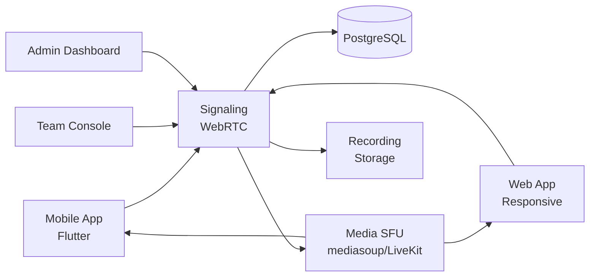

# Zoom Clone — White-Label Video Conferencing & Meetings Platform by Miracuves

**MXZoom** is a production-ready, white-label Zoom clone: a complete video-conferencing platform with meetings, breakout rooms, and admin console — delivered with **100% source code ownership** in **6 working days**.

> 📹 **See it running before you talk to anyone.** Live meetings, breakout rooms, and admin dashboard — demo credentials are printed on the [solution page](https://miracuves.com/zoom-clone#demo). No sales call required.

---

## 🚀 Live Demos

| Environment | URL | What you can test |
|---|---|---|
| 📱 Mobile App | [mas.mimeld.com](https://mas.mimeld.com) | Meet, call, share screen, chat |
| 🌐 Web App | [mxzoom.mimeld.com](https://mxzoom.mimeld.com) | Full meetings experience in browser |
| 👥 Team Console | [Solution page → Demo](https://miracuves.com/zoom-clone#demo) | Meetings, recordings, rooms, analytics |
| 🛠️ Admin Dashboard | [Solution page → Demo](https://miracuves.com/zoom-clone#demo) | Users, plans, storage, recordings |

Demo credentials for all environments: **[miracuves.com/zoom-clone → Demo section](https://miracuves.com/zoom-clone/#demo)**

---

## ✨ What Makes This Zoom Clone Different

Most video-app scripts stop at "video call." This platform ships with the features that actually run a meeting *business*:

- **Optimised Video Codec** — H.264 + VP8 + AV1 with SVC — low bandwidth with reliable quality — Zoom's R&D focus
- **Breakout Rooms + Whiteboard** — 
- **Cloud Recording + Transcripts** — instructor-led breakouts, pre-assigned and on-the-fly — what makes virtual classrooms possible
- **AI Meeting Assistant** — 10k+ attendee webinars with Q&A, polling, raise-hand — what made Zoom a billion-dollar business
- **Webinar Mode** — auto-chapters, action items, speaker stats — same feature Otter.ai and Zoom IQ sell

## 📦 Core Features

**User:** 1-click meetings · HD video & audio · screen share · recording · breakout rooms · chat · virtual backgrounds · captions

**Team/Org:** meeting rooms · unlimited meetings · cloud recording · team chat · scheduling · analytics

**Admin:** user management · plans & add-ons · storage quotas · SSO · analytics

## 🏗️ Architecture

**Stack:** Flutter mobile apps · Node.js backend · WebRTC for media · PostgreSQL · S3 for recordings · Stripe for billing · Stripe, regional gateways

## 📋 What’s Included

- ✅ Full source code — backend, web, mobile apps, panels (no encryption, no license locks)
- ✅ Deployment to your servers & app store submission assistance
- ✅ Your branding — white-label rename, logo, colors, domain
- ✅ 60 days post-launch support + 12 months of free updates
- ✅ Documentation & handover

**Pricing:** from **$3,099**, transparent on the [solution page](https://miracuves.com/zoom-clone/#pricing) — no "contact us for quote" games.

## 🆚 Why Not Build From Scratch?

Custom video-conferencing platforms run $100k–$500k and 6–14 months. A proven white-label base gets you to market in 6 working days for a fraction of that, with your budget preserved for media infrastructure and integrations.

## 📚 Resources

- 📖 [Zoom Clone — Full Solution Page](https://miracuves.com/zoom-clone) (features, pricing, demos, FAQ)
- 💰 [How Much Does a Video Conferencing App Cost in 2026?](https://miracuves.com/zoom-clone#pricing) pricing breakdown & what's included
- 📝 [Best Zoom Clone Script in 2026](https://miracuves.com/zoom-clone/blog/) features, pricing & launch guide
- 🧠 [SFU vs MCU: Why Modern Video Uses Selective Forwarding](https://miracuves.com/zoom-clone/blog/) media-server architecture
- ✅ [Miracuves Facts & Claims Ledger](https://miracuves.com/zoom-clone/facts/) every claim we make, verified

## 🏢 About Miracuves

[Miracuves Solutions](https://miracuves.com) builds white-label clone apps and custom software from Mumbai, India — 90+ ready-made solutions, live demos for every product, transparent pricing, and delivery in 6 working days. Operating since 2010.

**Talk to us:** [WhatsApp](https://wa.me/919830009649) · [Schedule a consultation](https://miracuves.com/schedule-consultation/) · [miracuves.com](https://miracuves.com)

---

### ⚠️ Note on This Repository

This repository is a product overview. The full source code is delivered to clients on purchase — see [what’s included](https://miracuves.com/zoom-clone/#included). For a hands-on evaluation, use the live demos above; credentials are public on the solution page.

*Keywords: zoom clone, zoom clone script, video conferencing, video meeting, white label Zoom, breakout rooms, Flutter video app, Node.js video*

---

<!--
══════════════════════════════════════════════════
TEMPLATE VARIABLE KEY — auto-generated from Netflix-Clone pattern
══════════════════════════════════════════════════
{APP_NAME}        Zoom Clone
{MX_NAME}         MXZoom
{CATEGORY}        Video Conferencing & Meetings Platform
{DEMO_WEB}        mxzoom.mimeld.com
{PRICE}           $3,099
{SLUG}            zoom-clone
{SOLUTION_URL}    https://miracuves.com/zoom-clone/
{VERTICAL}        video_conference

See /tmp/verticals/video_conference.txt for the vertical config used to generate this README.
══════════════════════════════════════════════════
-->